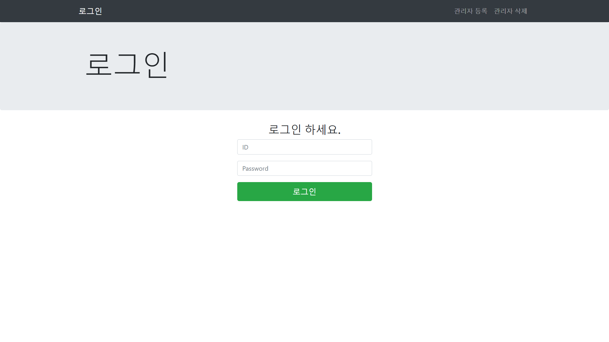
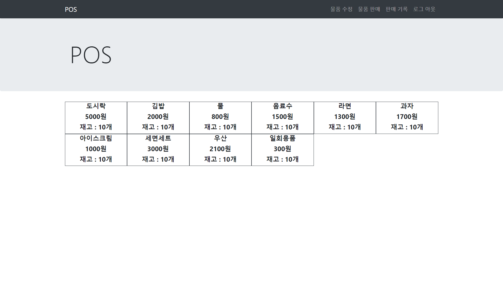
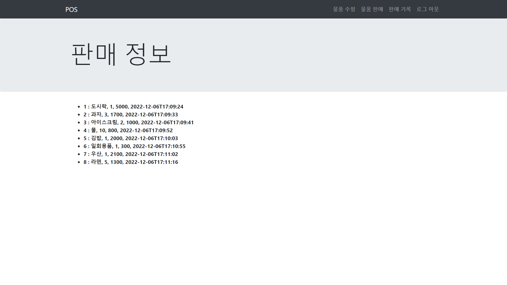

# Point_of_Sales

I created a POS web program using spring5.

- Implementation features: login, logout, add administrator, delete administrator, show product, modify inventory, sell goods, record sales

